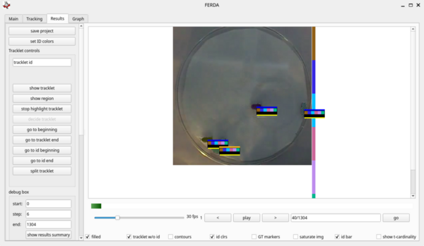

# FERDA - Fast Extremal Region Detector of Ants

FERDA is a multi object tracker developed mainly to meet the needs of biologists analyzing video sequences of small lab animal experiments.

## Installation

### Using Conda

Install Conda: https://conda.io.

Setup Conda environment with GUI support:

`$ conda env create -f conda_gui_exported.yml` or tune `conda_gui.yml`

Setup Conda environment for batch processing (without pyqt):

`$ conda env create -f conda_cli_exported.yml` or tune `conda_cli.yml`

### Manual

requires:
* python > 3.6
* [graph-tool](https://pypi.python.org/pypi/graph-tool)

`$ pip install -r requirements.txt`

## Quickstart

Activate environment if necessary:

`$ conda activate ferda_gui` or `$ conda activate ferda_cli`

Start gui:

`$ python main.py`

Create a new project. After finishing the new project wizard quit
the gui.

Note: when nothing is happening check the progress bars in the terminal.

Process a project using command line interface (possibly on a cluster):

`$ python ferda_cli.py --run-tracking --save-results-mot results.csv \
--project <project folder> \
--reidentification-weights /datagrid/ferda/models/180421_reidentification/Cam1_clip/best_model_996_weights.h5`

For more check `ferda_cli.py` help:

`$ python ferda_cli.py --help`
    
### Automatic Tracking    

1. create a new project
    1. set video range tracking arena and settings (sane defaults can be accepted)
    2. teach algorithm to distinguish single and multiple animals
        - sort out the regions into 4 categories using the buttons under the regions, the classifier will learn on the go
        - inspect the results in the *results viewer* by checking the *t-class* checker box
        - the animals should be correctly classified as single, multiple, etc.
2. quit the gui and use `ferda_cli.py` for project processing
3. inspect the results in the gui

### Creating Ground Truth

The usual goal is to assign an id to all tracklets of a reasonable size (e.g. > 10 frames). No id is assigned to short tracklets and to groups of animals.

1. start with project with trained *region classifier* without any identified tracklets
   (correcting all errors in automatic results tends to be slower than creating ground 
   truth from scratch)
2. play the video from the beginning until are the animals separated
3. click on an animal, press *d* and select an id, the assignment propagates 
   in the corresponding tracklet
4. skip to either end of the tracklet using "go to tracklet end" (ctrl + e), "go to tracklet group end" (ctrl + shift + e) or "tracklet start" (ctrl + s), "tracklet group start" (ctrl + shift + s)
5. play the video until there is a tracklet of a reasonable length for the animal (pay attention to the cyan tracklet length marker on the id bar)
6. go to 3. until the animal is marked in the whole sequence
7. go to the frame where are all animals separated
8. go to 3. and annotate next animal

## Keyboard Shortcuts

settings dialog
: ctrl + ,

### Results Viewer

step forward
: n

step backward
: b

play / pause
: space

increase step (step value is visible next to FPS display)
: 2

decrease step
: 1

assign id to tracklet
: d

assign id to tracklet (advanced)
: shift + d

show / hide all animals overlays
: h

## Unit Tests

Run unit tests:

`python -m unittest discover -v`

## Known Issues

`AttributeError: 'Vertex' object has no attribute 'in_neighbors'`

- solution: upgrade Graph-tool to version > 2.26

`OpenCV Error: Assertion failed (chunk.m_size <= 0xFFFF)`

- opencv 3.4.1 introduced the issue https://github.com/opencv/opencv/issues/11126
- solution: downgrade opencv to version 3.3.1 or upgrade to opencv with the mentioned issue solved

`sklearn/preprocessing/label.py:151: DeprecationWarning: The truth value of an empty array is ambiguous.`

- update sklearn or fix the line to `if len(diff):`
- see https://github.com/scikit-learn/scikit-learn/issues/10449

## Team

* author: Filip Naiser, CTU Prague <mailto:filip@naiser.cz>
* author: Matěj Šmíd, CTU Prague <mailto:smidm@fel.cvut.cz>
* collaborator: Barbara Casillas Perez, Cremer Group IST Austria 
* supervisor: Prof. Jiří Matas, CTU Prague

## Acknowledgement

* Dita Hollmannová - long term intern in CMP CTU Prague. Databases, visualisations, segmentation.
* Šimon Mandlík - long term intern in CMP CTU Prague. Visualisations, PCA of ant shapes, region fitting problem.
* Michael Hlaváček - 1 month intern in CMP CTU Prague, he was working on early version of results visualiser.

